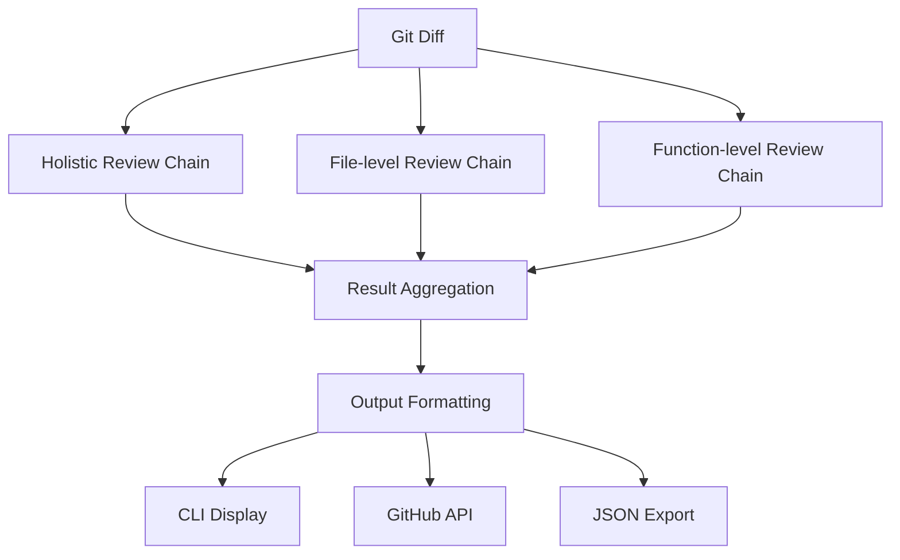

# CodeReviewAgent Architecture Design

## 🏗️ Core Architecture Overview

This document outlines the comprehensive design for a pluggable CodeReviewAgent that replaces the current CodeReviewService with a flexible, extensible architecture supporting multiple review chains, filters, formatters, and external tools.

## 📋 Design Principles

1. **Pluggable Architecture**: All components implement abstract interfaces for easy extension
2. **Configuration-Driven**: Single configuration object controls entire pipeline behavior
3. **Error Resilience**: Component failures don't break the entire pipeline
4. **Structured Output**: Pydantic models ensure consistent data flow
5. **Tool Integration**: External tools can be seamlessly integrated
6. **Registry System**: Dynamic component registration and instantiation

## 🏗️ Core Models and Configuration

### ReviewConfig

```python
# src/core/models/review_config.py
from typing import Dict, List, Optional, Any
from pydantic import BaseModel
from enum import Enum

class ReviewType(str, Enum):
    BUGS = "bugs"
    SECURITY = "security"
    PERFORMANCE = "performance"
    STYLE = "style"
    BEST_PRACTICES = "best_practices"
    ARCHITECTURE = "architecture"
    REFACTORING = "refactoring"

class ReviewConfig(BaseModel):
    # Core review types
    enabled_review_types: List[ReviewType] = [
        ReviewType.BUGS,
        ReviewType.SECURITY,
        ReviewType.PERFORMANCE,
        ReviewType.STYLE,
        ReviewType.BEST_PRACTICES
    ]
    
    # Pipeline configuration
    enable_holistic_review: bool = True
    enable_file_level_review: bool = True
    enable_function_level_review: bool = True
    
    # Output configuration
    output_format: str = "cli"  # cli, json, markdown, github
    include_suggestions: bool = True
    include_code_examples: bool = True
    
    # Extensibility
    custom_chains: List[str] = []
    custom_tools: Dict[str, Any] = {}
    
    # LLM configuration
    max_tokens_per_request: int = 4000
    temperature: float = 0.1
    enable_structured_output: bool = True
```

### ReviewFinding

```python
# src/core/models/review_finding.py
from typing import Optional, Dict, Any, Tuple
from pydantic import BaseModel
from enum import Enum

class Severity(str, Enum):
    CRITICAL = "critical"
    MAJOR = "major"
    MINOR = "minor"
    SUGGESTION = "suggestion"

class Category(str, Enum):
    BUG = "bug"
    SECURITY = "security"
    PERFORMANCE = "performance"
    STYLE = "style"
    ARCHITECTURE = "architecture"
    BEST_PRACTICES = "best_practices"
    MAINTAINABILITY = "maintainability"
    READABILITY = "readability"


class ReviewFinding(BaseModel):
    """Represents a single finding from the code review."""
    
    severity: Severity
    category: Category
    file_path: str
    line_number: Optional[int] = None
    line_range: Optional[Tuple[int, int]] = None
    message: str
    suggestion: Optional[str] = None
    code_example: Optional[str] = None
    confidence: float = 1.0  # Confidence score from 0.0 to 1.0
    tool_name: Optional[str] = None  # Which tool/chain generated this finding
    metadata: Dict[str, Any] = {}
```

### ReviewResult

```python
# src/core/models/review_result.py
from typing import List, Dict, Any
from pydantic import BaseModel
from collections import defaultdict

from core.models.review_finding import ReviewFinding, Severity, Category


class ReviewResult(BaseModel):
    """Aggregated results of a code review."""
    
    findings: List[ReviewFinding]
    summary: Dict[str, Dict[str, int]]  # e.g., {"severity": {"critical": 1}, "category": {"bug": 1}}
    total_files_reviewed: int
    total_lines_reviewed: int
    review_duration: float  # in seconds
    metadata: Dict[str, Any] = {}
    
    @classmethod
    def aggregate(cls, findings: List[ReviewFinding]) -> "ReviewResult":
        """
        Aggregates findings, deduplicates, and generates a summary.
        """
        # Simple deduplication for now (can be enhanced later)
        unique_findings = []
        seen_findings = set()
        for finding in findings:
            finding_tuple = (
                finding.file_path,
                finding.line_number,
                finding.message,
                finding.category.value,
                finding.severity.value,
            )
            if finding_tuple not in seen_findings:
                unique_findings.append(finding)
                seen_findings.add(finding_tuple)

        # Generate summary
        summary_by_severity = defaultdict(int)
        summary_by_category = defaultdict(int)
        
        for finding in unique_findings:
            summary_by_severity[finding.severity.value] += 1
            summary_by_category[finding.category.value] += 1
            
        summary = {
            "severity": dict(summary_by_severity),
            "category": dict(summary_by_category),
        }
        
        # Placeholder for actual counts and duration
        total_files = len(set(f.file_path for f in unique_findings))
        total_lines = 0 # This would require more context from diffs
        duration = 0.0 # This would be calculated during the review process
        
        return cls(
            findings=unique_findings,
            summary=summary,
            total_files_reviewed=total_files,
            total_lines_reviewed=total_lines,
            review_duration=duration,
        )
```

## 🔧 Abstract Base Classes

### ReviewChain Interface

```python
# src/core/interfaces/review_chain.py
from abc import ABC, abstractmethod
from typing import List, Dict, Any

from langchain_core.language_models import BaseLanguageModel

from core.models.code_diff import CodeDiff
from core.models.review_finding import ReviewFinding
from core.models.review_config import ReviewConfig
from core.interfaces.llm_provider import LLMProvider


class ReviewChain(ABC):
    """Abstract base class for review chain components."""
    
    def __init__(self, llm_provider: LLMProvider, config: ReviewConfig):
        self.llm_provider = llm_provider
        self.config = config
    
    @abstractmethod
    def review(
        self, 
        diffs: List[CodeDiff], 
        llm: BaseLanguageModel
    ) -> List[ReviewFinding]:
        """Execute the review chain and return findings."""
        pass
    
    @abstractmethod
    def get_chain_name(self) -> str:
        """Return the name of this review chain."""
        pass
    
    def is_enabled(self) -> bool:
        """Check if this chain is enabled in the configuration."""
        return True  # Override in subclasses
```

### ReviewFormatter Interface

```python
# src/core/interfaces/review_formatter.py
from abc import ABC, abstractmethod

from core.models.review_result import ReviewResult


class ReviewFormatter(ABC):
    """Abstract base class for output formatting components."""
    
    @abstractmethod
    def format(self, result: ReviewResult) -> str:
        """Format the review result for output."""
        pass
    
    @abstractmethod
    def get_formatter_name(self) -> str:
        """Return the name of this formatter."""
        pass
```

### ReviewTool Interface

```python
# src/core/interfaces/review_tool.py
from abc import ABC, abstractmethod
from typing import Dict, Any, List

from core.models.code_diff import CodeDiff


class ReviewTool(ABC):
    """Abstract base class for external tools integration."""
    
    @abstractmethod
    def analyze(self, diffs: List[CodeDiff]) -> Dict[str, Any]:
        """Analyze code diffs and return tool-specific results."""
        pass
    
    @abstractmethod
    def get_tool_name(self) -> str:
        """Return the name of this tool."""
        pass
```

## 🤖 Main CodeReviewAgent Class

```python
# src/core/services/code_review_agent.py
import time
from typing import Any, Dict, List, Optional

import typer
from langchain_core.language_models import BaseLanguageModel

from core.interfaces.diff_provider import DiffProvider
from core.interfaces.llm_provider import LLMProvider
from core.interfaces.review_chain import ReviewChain
from core.interfaces.review_formatter import ReviewFormatter
from core.interfaces.review_tool import ReviewTool
from core.models.code_diff import CodeDiff
from core.models.review_command_args import ReviewCommandArgs
from core.models.review_config import ReviewConfig
from core.models.review_finding import ReviewFinding
from core.models.review_result import ReviewResult
from core.utils.llm_utils import get_model_info


class CodeReviewAgent:
    """
    Comprehensive code review agent with pluggable architecture.
    Orchestrates the entire review pipeline with configurable components.
    """
    
    def __init__(
        self,
        diff_provider: DiffProvider,
        llm_provider: LLMProvider,
        config: Optional[ReviewConfig] = None
    ):
        self.diff_provider = diff_provider
        self.llm_provider = llm_provider
        self.config = config or ReviewConfig()
        
        # Pluggable components
        self._review_chains: List[ReviewChain] = []
        self._formatters: Dict[str, ReviewFormatter] = {}
        self._tools: Dict[str, ReviewTool] = {}
        
        # Initialize default components
        self._initialize_default_components()
    
    def _initialize_default_components(self):
        """Initialize default review chains, filters, and formatters."""
        # Register and add default chains (e.g., HolisticReviewChain)
        # Register and add default formatters (e.g., CliFormatter)
        pass
    
    def add_review_chain(self, chain: ReviewChain) -> "CodeReviewAgent":
        """Add a review chain to the pipeline."""
        self._review_chains.append(chain)
        return self
    
    def add_formatter(self, name: str, formatter: ReviewFormatter) -> "CodeReviewAgent":
        """Add a formatter for output generation."""
        self._formatters[name] = formatter
        return self
    
    def add_tool(self, name: str, tool: ReviewTool) -> "CodeReviewAgent":
        """Add an external tool for analysis."""
        self._tools[name] = tool
        return self
    
    def review_code(self, args: ReviewCommandArgs) -> ReviewResult:
        """
        Execute the complete review pipeline.
        """
        start_time = time.time()
        
        # 1. Initialize LLM
        llm: BaseLanguageModel = self.llm_provider.get_llm(args=args)
        model_info = get_model_info(llm)
        typer.echo(
            f"Using LLM: {model_info['name']} ({model_info['provider']}) - {args.model}"
        )
        
        # 2. Get diffs
        diffs: List[CodeDiff] = self.diff_provider.get_diff()
        typer.echo(f"Diff between {args.source} and {args.target} in {args.repo_path}:")
        typer.echo(f"Total changes: {len(diffs)} files modified.")
        
        # 3. Execute review chains
        all_findings = self._execute_review_chains(diffs, llm)
        
        # 4. Aggregate results
        end_time = time.time()
        duration = end_time - start_time
        
        result = ReviewResult.aggregate(all_findings)
        result.review_duration = duration
        result.total_files_reviewed = len(set(d.file_path for d in diffs))
        # total_lines_reviewed would require more detailed diff parsing
        
        # 5. Format and display output
        self._output_results(result)
        
        return result
    
    def _execute_review_chains(
        self, 
        diffs: List[CodeDiff], 
        llm: BaseLanguageModel
    ) -> List[ReviewFinding]:
        """Execute all enabled review chains."""
        all_findings = []
        for chain in self._review_chains:
            if chain.is_enabled():
                try:
                    findings = chain.review(diffs, llm)
                    all_findings.extend(findings)
                    typer.echo(f"Completed review: {chain.get_chain_name()}")
                except Exception as e:
                    typer.echo(f"Warning: Chain {chain.get_chain_name()} failed: {e}")
        return all_findings
    
    def _output_results(self, result: ReviewResult):
        """Format and output the review results."""
        formatter_name = self.config.output_format
        if formatter_name in self._formatters:
            formatter = self._formatters[formatter_name]
            output = formatter.format(result)
            typer.echo(output)
        else:
            # Fallback to simple output
            typer.echo(f"Review completed: {len(result.findings)} findings")
```

## 🔌 Plugin Registry System

```python
# src/core/registry/component_registry.py
from typing import Dict, Type, Any
from core.interfaces.review_chain import ReviewChain
from core.interfaces.review_formatter import ReviewFormatter
from core.interfaces.review_tool import ReviewTool

class ComponentRegistry:
    """Registry for pluggable components."""
    
    def __init__(self):
        self._chains: Dict[str, Type[ReviewChain]] = {}
        self._formatters: Dict[str, Type[ReviewFormatter]] = {}
        self._tools: Dict[str, Type[ReviewTool]] = {}
    
    def register_chain(self, name: str, chain_class: Type[ReviewChain]):
        """Register a review chain class."""
        if not issubclass(chain_class, ReviewChain):
            raise TypeError(f"Class {chain_class.__name__} must inherit from ReviewChain")
        self._chains[name] = chain_class
    
    def register_formatter(self, name: str, formatter_class: Type[ReviewFormatter]):
        """Register a formatter class."""
        if not issubclass(formatter_class, ReviewFormatter):
            raise TypeError(f"Class {formatter_class.__name__} must inherit from ReviewFormatter")
        self._formatters[name] = formatter_class
    
    def register_tool(self, name: str, tool_class: Type[ReviewTool]):
        """Register a tool class."""
        if not issubclass(tool_class, ReviewTool):
            raise TypeError(f"Class {tool_class.__name__} must inherit from ReviewTool")
        self._tools[name] = tool_class
    
    def create_chain(self, name: str, *args, **kwargs) -> ReviewChain:
        """Create an instance of a registered chain."""
        if name not in self._chains:
            raise ValueError(f"Chain '{name}' not registered")
        return self._chains[name](*args, **kwargs)
    
    def create_formatter(self, name: str, *args, **kwargs) -> ReviewFormatter:
        """Create an instance of a registered formatter."""
        if name not in self._formatters:
            raise ValueError(f"Formatter '{name}' not registered")
        return self._formatters[name](*args, **kwargs)
    
    def create_tool(self, name: str, *args, **kwargs) -> ReviewTool:
        """Create an instance of a registered tool."""
        if name not in self._tools:
            raise ValueError(f"Tool '{name}' not registered")
        return self._tools[name](*args, **kwargs)


# Global registry instance
registry = ComponentRegistry()
```

## 🔄 Review Pipeline Flow



## 🚀 Key Benefits

1. **Extensibility**: New components can be added without modifying core code
2. **Configurability**: Entire pipeline behavior controlled through configuration
3. **Modularity**: Each component has a single responsibility
4. **Testability**: Components can be tested in isolation
5. **Error Resilience**: Component failures don't break the pipeline
6. **Tool Integration**: External tools easily integrated through standard interface
7. **Multiple Outputs**: Support for various output formats (CLI, GitHub, JSON)

## 📁 Proposed File Structure

```
src/
├── core/
│   ├── interfaces/
│   │   ├── review_chain.py
│   │   ├── review_formatter.py
│   │   └── review_tool.py
│   ├── models/
│   │   ├── review_config.py
│   │   ├── review_finding.py
│   │   └── review_result.py
│   ├── services/
│   │   └── code_review_agent.py
│   ├── registry/
│   │   └── component_registry.py
│   ├── chains/
│   │   ├── holistic_review_chain.py
│   │   ├── file_review_chain.py
│   │   └── function_review_chain.py
│   ├── formatters/
│   │   ├── cli_formatter.py
│   │   ├── github_formatter.py
│   │   └── json_formatter.py
│   └── tools/
│       ├── tree_sitter_tool.py
│       └── static_analysis_tool.py
