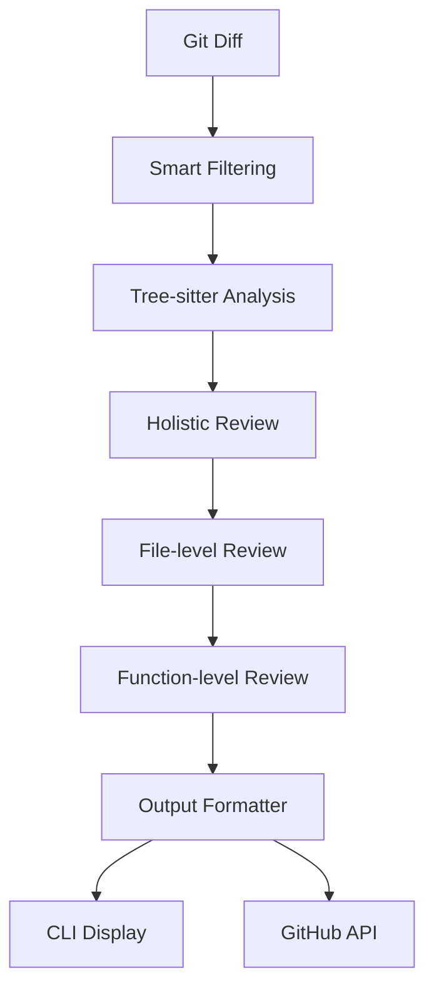

# LangChain Integration Strategy for Code Reviews

Based on your requirements, here's a comprehensive plan for leveraging LangChain in your code review tool:

## 🏗️ Core Architecture Design

**Multi-Step Review Pipeline**



## 🔧 Key LangChain Integration Points

### 1. Prompt Templates & Chains

- Use `ChatPromptTemplate` for configurable review prompts
- Implement `LLMChain` for multi-step analysis
- Create specialized prompts for holistic, file-level, and function-level reviews

### 2. Structured Output Parsing

- Leverage `PydanticOutputParser` for consistent review results
- Define structured models for bugs, security issues, style suggestions, etc.

### 3. Review Configuration System

```python
class ReviewConfig(BaseModel):
    check_bugs: bool = True
    check_security: bool = True
    check_performance: bool = True
    check_style: bool = True
    check_best_practices: bool = True
    check_architecture: bool = False
    suggest_refactoring: bool = False
```

## 📋 Implementation Phases

### Phase 1: Core LangChain Integration

- Enhance existing `LangChainProvider` with prompt templates
- Create `ReviewFinding` model with structured output parsing
- Implement basic holistic review chain in `CodeReviewService`

### Phase 2: Smart Filtering & Context

- Add Tree-sitter integration for semantic code analysis
- Implement smart diff filtering to focus on high-impact changes
- Build context extraction for modified functions and their dependencies

### Phase 3: Multi-Step Pipeline

- Create file-level and function-level review chains
- Implement review result aggregation and deduplication
- Add rich CLI output formatting with colored diffs and inline suggestions

### Phase 4: External Integration

- GitHub API integration for posting PR comments with file/line references
- Plugin system for extensible review steps
- Performance optimizations and result caching

## 🎯 Specific LangChain Components

### Prompt Engineering

```python
from langchain.prompts import ChatPromptTemplate, SystemMessagePromptTemplate

holistic_prompt = ChatPromptTemplate.from_messages([
    SystemMessagePromptTemplate.from_template(
        "You are a senior software engineer. Review these code changes for {review_types}..."
    ),
    ("human", "Changes:\n{diff_content}\n\nContext:\n{code_context}")
])
```

### Output Models

```python
from pydantic import BaseModel
from typing import Optional, Literal

class ReviewFinding(BaseModel):
    severity: Literal["critical", "major", "minor", "suggestion"]
    category: Literal["bug", "security", "performance", "style", "architecture"]
    file_path: str
    line_number: Optional[int]
    message: str
    suggestion: Optional[str]
```

### Review Chains

- **Holistic analysis** for architectural impact
- **File-level analysis** for imports, exports, patterns
- **Function-level analysis** for logic, complexity, edge cases

## 🚀 Advanced Features

### Context-Aware Reviews

- Tree-sitter integration for understanding code structure
- Function signature extraction and dependency tracking
- Cross-file impact analysis

### Smart Filtering

- Skip formatting-only changes (whitespace, imports reordering)
- Prioritize new functions, modified logic, security-sensitive code
- Focus on semantic changes vs. syntactic changes

### Extensible Architecture

- Plugin system for custom review steps (linting, testing, security scans)
- Configurable prompt templates for domain-specific reviews
- Integration hooks for external tools

## 📁 Proposed File Structure

```
src/
├── core/
│   ├── chains/
│   │   ├── holistic_review_chain.py
│   │   ├── file_review_chain.py
│   │   └── function_review_chain.py
│   ├── models/
│   │   ├── review_finding.py
│   │   ├── review_config.py
│   │   └── review_result.py
│   ├── prompts/
│   │   ├── review_prompts.py
│   │   └── prompt_templates.py
│   ├── parsers/
│   │   ├── diff_parser.py
│   │   └── tree_sitter_parser.py
│   ├── filters/
│   │   └── smart_diff_filter.py
│   └── formatters/
│       ├── cli_formatter.py
│       └── github_formatter.py
```

## 🔄 Review Pipeline Flow

1. **Input Processing**
   - Parse Git diff using existing `GitDiffProvider`
   - Apply smart filtering to focus on high-impact changes
   - Extract code context using Tree-sitter

2. **Multi-Level Analysis**
   - **Holistic Review**: Overall architecture impact, cross-file dependencies
   - **File-Level Review**: File-specific patterns, imports, exports
   - **Function-Level Review**: Individual function logic, complexity, edge cases

3. **Result Processing**
   - Aggregate findings from all review levels
   - Deduplicate similar issues
   - Prioritize by severity and category

4. **Output Generation**
   - Rich CLI output with colored diffs and inline suggestions
   - GitHub-compatible PR comments with file/line references
   - Structured JSON/Markdown reports

## 🛠️ Implementation Details

### Enhanced CodeReviewService

```python
class CodeReviewService:
    def __init__(
        self, 
        diff_provider: DiffProvider, 
        llm_provider: LLMProvider,
        review_config: ReviewConfig
    ):
        self.diff_provider = diff_provider
        self.llm_provider = llm_provider
        self.review_config = review_config
        self.holistic_chain = HolisticReviewChain(llm_provider)
        self.file_chain = FileReviewChain(llm_provider)
        self.function_chain = FunctionReviewChain(llm_provider)

    def review_code(self, args: ReviewCommandArgs) -> ReviewResult:
        # 1. Get and filter diffs
        diffs = self.diff_provider.get_diff()
        filtered_diffs = SmartDiffFilter.filter(diffs)
        
        # 2. Extract code context
        context = TreeSitterParser.extract_context(filtered_diffs)
        
        # 3. Multi-level analysis
        holistic_findings = self.holistic_chain.review(filtered_diffs, context)
        file_findings = self.file_chain.review(filtered_diffs, context)
        function_findings = self.function_chain.review(filtered_diffs, context)
        
        # 4. Aggregate and format results
        all_findings = holistic_findings + file_findings + function_findings
        return ReviewResult.aggregate(all_findings)
```

### Smart Diff Filtering

```python
class SmartDiffFilter:
    @staticmethod
    def filter(diffs: List[CodeDiff]) -> List[CodeDiff]:
        filtered = []
        for diff in diffs:
            if SmartDiffFilter.is_high_impact(diff):
                filtered.append(diff)
        return filtered
    
    @staticmethod
    def is_high_impact(diff: CodeDiff) -> bool:
        # Skip formatting-only changes
        if SmartDiffFilter.is_formatting_only(diff.diff):
            return False
        
        # Prioritize new functions, modified logic
        if SmartDiffFilter.contains_new_functions(diff.diff):
            return True
            
        # Check for security-sensitive patterns
        if SmartDiffFilter.is_security_sensitive(diff.diff):
            return True
            
        return True  # Default to including
```

This architecture leverages LangChain's strengths while maintaining your existing clean separation of concerns. The multi-step pipeline enables comprehensive analysis while smart filtering ensures efficiency with large diffs.
