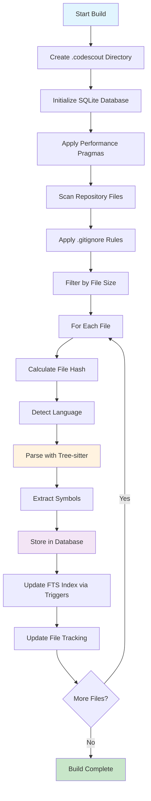
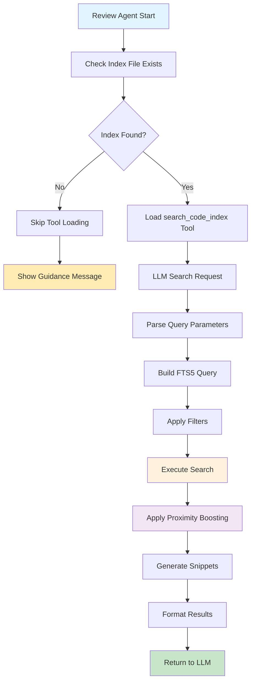
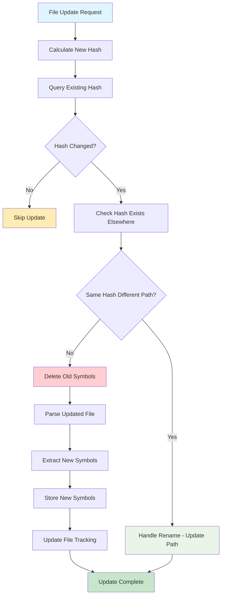

# Code Index Service Architecture

## Overview

This document outlines the architectural design for the Code Index Service, a disk-based, opt-in capability that enhances the code review system by providing intelligent symbol discovery and search functionality. The service enables the LLM to find and understand code symbols (functions, classes, methods, variables) across the entire codebase, not just the files being reviewed.

**Key Principles:**

- **Index presence gates features**: The LLM review agent only loads the `search_code_index` tool if a local index exists
- **On-disk only**: The index is always stored as a SQLite file on disk at `./.codescout/code_index.db`
- **Explicit lifecycle**: Indexing is explicit via CLI commands (build/update/rebuild)
- **Repository-scoped**: Users run CLI from repository root; respects `.gitignore` and relative paths

## Component Breakdown

### 1. Code Index Extractor (`CodeIndexExtractor`)

**Responsibilities:**

- Parse source code files using Tree-sitter with lazy-loaded grammars
- Extract symbols (functions, classes, methods, variables, imports) with metadata
- Handle all languages supported by Tree-sitter
- Provide symbol context information (parameters, return types, docstrings)

**Key Features:**

- Language-agnostic parsing through Tree-sitter
- Lazy-loaded language grammars for performance
- Configurable symbol types extraction
- Context-aware symbol metadata extraction
- Error handling for malformed code with per-file isolation

### 2. Code Index Repository (`CodeIndexRepository`)

**Responsibilities:**

- Manage SQLite database operations for code index storage
- Provide CRUD operations for symbols with FTS5 integration
- Handle database schema migrations and optimization
- Manage SQLite connection lifecycle

**Key Features:**

- FTS5 full-text search with trigger-based synchronization
- Transactional operations for data consistency
- Batch operations for efficient bulk updates
- SQLite optimization with WAL mode and performance pragmas
- Parameterized queries for security

### 3. Code Index Search Engine (`CodeIndexSearchEngine`)

**Responsibilities:**

- Provide FTS5-based symbol search functionality
- Implement proximity boosting for relevant results
- Handle complex search queries with filters
- Rank and format search results

**Key Features:**

- SQLite FTS5 search with prefix support (`auth*`)
- Proximity boosting (same file, directory, language, exact matches)
- Multi-criteria filtering (file path, symbol type, language)
- Deterministic result ranking and relevance scoring
- Compact snippet generation for results

### 4. Code Index Manager (`CodeIndexManager`)

**Responsibilities:**

- Main orchestration layer for all code index operations
- Coordinate between different components
- Handle CLI-based operations with explicit lifecycle
- Manage file tracking and incremental updates

**Key Features:**

- Unified API for all code index operations
- Stateless operation suitable for CLI usage
- File hash-based change detection
- Rename detection and handling
- Configuration management and error handling

### 5. Search Code Index Tool (`SearchCodeIndexTool`)

**Responsibilities:**

- Implement LangChain tool interface for LLM integration
- Provide natural language interface for code index search
- Format search results for LLM consumption
- Handle conditional loading based on index presence

**Key Features:**

- LangChain BaseTool implementation
- Conditional tool injection based on index file existence
- Natural language query processing
- Structured result formatting with snippets and context
- Boost paths integration for diff-aware search

## Data Models/Schema

### SQLite Database Schema

```sql
-- SQLite optimization pragmas (applied on connection open)
PRAGMA journal_mode=WAL;
PRAGMA synchronous=NORMAL;
PRAGMA temp_store=MEMORY;
PRAGMA cache_size=-20000;

-- Metadata table for revision tracking and other settings
CREATE TABLE code_index_meta (
    key TEXT PRIMARY KEY,
    value TEXT NOT NULL
);
-- Example entries: ('revision','<git-sha>'), ('built_at','<timestamp>'), ('version','1.0')

-- Main code index table (project_id removed - one DB per repo)
CREATE TABLE code_index (
    id INTEGER PRIMARY KEY AUTOINCREMENT,
    name TEXT NOT NULL,
    symbol_type TEXT NOT NULL, -- 'function', 'class', 'method', 'variable', 'import'
    file_path TEXT NOT NULL,
    line_number INTEGER NOT NULL,
    column_number INTEGER,
    end_line_number INTEGER,
    end_column_number INTEGER,
    language TEXT NOT NULL,
    signature TEXT, -- Function/method signature
    docstring TEXT, -- Documentation string
    parent_symbol TEXT, -- For methods/nested functions
    scope TEXT, -- 'public', 'private', 'protected'
    parameters TEXT, -- JSON array of parameter info
    return_type TEXT,
    file_hash TEXT NOT NULL, -- For change detection
    created_at TIMESTAMP DEFAULT CURRENT_TIMESTAMP,
    updated_at TIMESTAMP DEFAULT CURRENT_TIMESTAMP,
    
    -- Uniqueness constraint (simplified without project_id)
    UNIQUE(file_path, symbol_type, name, line_number, end_line_number)
);

-- FTS5 virtual table for full-text search with prefix optimization
CREATE VIRTUAL TABLE code_index_fts USING fts5(
    name,
    signature,
    docstring,
    parent_symbol,
    file_path,
    language,
    content='code_index',
    content_rowid='id',
    prefix='2 3 4'  -- Enable prefix search for 2, 3, and 4 character prefixes
);

-- Triggers to keep FTS table synchronized (using safe delete+insert pattern)
CREATE TRIGGER code_index_after_insert AFTER INSERT ON code_index BEGIN
    INSERT INTO code_index_fts(rowid, name, signature, docstring, parent_symbol, file_path, language)
    VALUES (new.id, new.name, new.signature, new.docstring, new.parent_symbol, new.file_path, new.language);
END;

CREATE TRIGGER code_index_after_update AFTER UPDATE ON code_index BEGIN
    INSERT INTO code_index_fts(code_index_fts, rowid) VALUES('delete', old.id);
    INSERT INTO code_index_fts(rowid, name, signature, docstring, parent_symbol, file_path, language)
    VALUES (new.id, new.name, new.signature, new.docstring, new.parent_symbol, new.file_path, new.language);
END;

CREATE TRIGGER code_index_after_delete AFTER DELETE ON code_index BEGIN
    INSERT INTO code_index_fts(code_index_fts, rowid) VALUES('delete', old.id);
END;

-- Indexes for performance (simplified without project_id)
CREATE INDEX idx_code_index_name ON code_index(name);
CREATE INDEX idx_code_index_type ON code_index(symbol_type);
CREATE INDEX idx_code_index_file_path ON code_index(file_path);
CREATE INDEX idx_code_index_language ON code_index(language);
CREATE INDEX idx_code_index_parent ON code_index(parent_symbol);
CREATE INDEX idx_code_index_file_hash ON code_index(file_hash);
CREATE INDEX idx_code_index_file_line ON code_index(file_path, line_number); -- For fast updates
CREATE INDEX idx_code_index_composite ON code_index(name, symbol_type, file_path);

-- File tracking table for incremental updates (simplified without project_id)
CREATE TABLE indexed_files (
    id INTEGER PRIMARY KEY AUTOINCREMENT,
    file_path TEXT UNIQUE NOT NULL,
    file_hash TEXT NOT NULL,
    symbol_count INTEGER DEFAULT 0,
    last_indexed TIMESTAMP DEFAULT CURRENT_TIMESTAMP
);

CREATE INDEX idx_indexed_files_path ON indexed_files(file_path);
CREATE INDEX idx_indexed_files_hash ON indexed_files(file_hash);
```

## Core Class/Module Design

### CodeIndexManager (Main Orchestrator)

```python
class CodeIndexManager:
    def __init__(self, db_path: str, config: CodeIndexConfig):
        self.db_path = db_path
        self.config = config
        self.repository = CodeIndexRepository(db_path)
        self.extractor = CodeIndexExtractor()
        self.search_engine = CodeIndexSearchEngine(self.repository, config)
    
    def build_index(self, repo_path: str, project_id: str, revision: str = None) -> IndexResult
    def update_file(self, file_path: str, project_id: str, revision: str = None) -> UpdateResult
    def rebuild_index(self, repo_path: str, project_id: str, revision: str = None) -> IndexResult
    def search_symbols(self, query: CodeIndexQuery) -> List[CodeSymbol]
    def get_index_stats(self, project_id: str) -> IndexStats
    def get_symbol_types(self) -> List[str]  # SELECT DISTINCT symbol_type FROM code_index ORDER BY symbol_type
    def index_exists(self) -> bool
    def validate_schema(self) -> bool
```

### CodeIndexExtractor (Tree-sitter Integration)

```python
class CodeIndexExtractor:
    def __init__(self):
        self.supported_languages = ["all"]  # Support all Tree-sitter languages by default
        self.parsers = {}  # Lazy-loaded parsers
    
    def extract_symbols(self, file_path: str, content: str, project_id: str, revision: str = None) -> List[CodeSymbol]
    def _get_parser(self, language: str) -> Parser
    def _parse_file(self, content: str, language: str) -> Tree
    def _extract_functions(self, node: Node, source: bytes, file_path: str) -> List[CodeSymbol]
    def _extract_classes(self, node: Node, source: bytes, file_path: str) -> List[CodeSymbol]
    def _extract_variables(self, node: Node, source: bytes, file_path: str) -> List[CodeSymbol]
    def _get_symbol_signature(self, node: Node, source: bytes) -> str
    def _get_docstring(self, node: Node, source: bytes) -> Optional[str]
    def _detect_language(self, file_path: str) -> Optional[str]
```

### CodeIndexRepository (Database Layer)

```python
class CodeIndexRepository:
    def __init__(self, db_path: str):
        self.db_path = db_path
        self.connection = None
    
    def initialize_database(self) -> None
    def insert_symbols(self, symbols: List[CodeSymbol]) -> None
    def update_symbols(self, symbols: List[CodeSymbol]) -> None
    def delete_symbols_by_file(self, project_id: str, file_path: str) -> None
    def search_fts(self, query: str, filters: SearchFilters) -> List[CodeSymbol]
    def get_symbols_by_file(self, project_id: str, file_path: str) -> List[CodeSymbol]
    def get_file_hash(self, project_id: str, file_path: str) -> Optional[str]
    def update_file_tracking(self, project_id: str, file_path: str, file_hash: str, symbol_count: int) -> None
    def get_index_statistics(self, project_id: str) -> IndexStats
    def _apply_sqlite_pragmas(self) -> None
```

### CodeIndexSearchEngine (Search Logic)

```python
class CodeIndexSearchEngine:
    def __init__(self, repository: CodeIndexRepository, config: CodeIndexConfig):
        self.repository = repository
        self.config = config
    
    def search(self, query: CodeIndexQuery) -> SearchResult
    def _build_fts_query(self, text: str) -> str
    def _apply_proximity_boosting(self, symbols: List[CodeSymbol], boost_paths: List[str]) -> List[CodeSymbol]
    def _calculate_relevance_score(self, symbol: CodeSymbol, query: str, boost_paths: List[str]) -> float
    def _apply_filters(self, symbols: List[CodeSymbol], filters: SearchFilters) -> List[CodeSymbol]
    def _generate_snippet(self, symbol: CodeSymbol) -> str
    def _format_search_results(self, symbols: List[CodeSymbol], query: str) -> List[SearchResultItem]
```

### SearchCodeIndexTool (LangChain Integration)

```python
class SearchCodeIndexTool(LangChainReviewTool):
    def __init__(self, db_path: str = "./.codescout/code_index.db"):
        self.db_path = db_path
    
    def get_tool(self, diffs: List[CodeDiff]) -> Optional[BaseTool]:
        # Only return tool if index exists
        if not self.index_exists():
            return None
            
        @tool("search_code_index")
        def search_code_index(
            query: Annotated[str, "Search query for finding code symbols"],
            symbol_type: Annotated[Optional[str], "Filter by symbol type: function, class, method, variable"],
            file_pattern: Annotated[Optional[str], "Filter by file path pattern"],
            limit: Annotated[int, "Maximum number of results"] = 20
        ) -> str:
            # Create manager instance for this operation
            config = CodeIndexConfig()
            manager = CodeIndexManager(self.db_path, config)
            
            # Extract boost paths from current diff
            boost_paths = [diff.file_path for diff in diffs]
            
            # Perform search
            query_obj = CodeIndexQuery(
                text=query,
                symbol_type=symbol_type,
                file_pattern=file_pattern,
                limit=limit,
                boost_paths=boost_paths
            )
            results = manager.search_symbols(query_obj)
            
            # Format results for LLM (cap snippets to protect token budget)
            return self._format_search_results(results)
        
        return search_code_index
    
    def index_exists(self) -> bool:
        """Check if the code index database exists and has valid schema."""
        from pathlib import Path
        if not Path(self.db_path).exists():
            return False
        
        # Validate schema
        try:
            config = CodeIndexConfig()
            manager = CodeIndexManager(self.db_path, config)
            return manager.validate_schema()
        except Exception:
            return False
    
    def _format_search_results(self, results: List[CodeSymbol]) -> str:
        """Format search results for LLM consumption with capped snippets."""
        if not results:
            return "No symbols found matching the query."
        
        formatted_results = []
        for symbol in results:
            result_item = {
                "name": symbol.name,
                "type": symbol.symbol_type,
                "file": symbol.file_path,
                "line": symbol.line_number,
                "language": symbol.language
            }
            
            if symbol.signature:
                result_item["signature"] = symbol.signature
            
            if symbol.docstring:
                # Cap docstring to reasonable length
                result_item["doc"] = symbol.docstring[:200] + "..." if len(symbol.docstring) > 200 else symbol.docstring
            
            # Generate capped snippet (function/class block or ±10 lines, max ~40-60 lines)
            if hasattr(symbol, 'snippet'):
                result_item["snippet"] = symbol.snippet
            
            if hasattr(symbol, 'score'):
                result_item["score"] = f"{symbol.score:.2f}"
            
            if hasattr(symbol, 'reasons'):
                result_item["reasons"] = symbol.reasons
            
            formatted_results.append(result_item)
        
        return f"Found {len(results)} symbols:\n" + "\n".join([
            f"- {item['type']}: {item['name']} ({item['file']}:{item['line']})" +
            (f"\n  Signature: {item['signature']}" if 'signature' in item else "") +
            (f"\n  Doc: {item['doc']}" if 'doc' in item else "") +
            (f"\n  Snippet:\n{item['snippet']}" if 'snippet' in item else "") +
            (f"\n  Score: {item['score']} ({', '.join(item['reasons'])})" if 'score' in item else "")
            for item in formatted_results
        ])
```

## CLI Command Structure

### Main CLI Integration (`src/cli/main.py`)

```python
# Add to imports
from cli.index_cli import app as index_app

# Add to main app
app.add_typer(
    index_app,
    name="index",
    help="Commands for managing the code index.",
)
```

### New Index CLI Module (`src/cli/index_cli.py`)

```python
import typer
import os
from pathlib import Path
from typing import Optional

from cli.code_scout_context import CodeScoutContext
from core.code_index.code_index_manager import CodeIndexManager
from core.code_index.code_index_config import CodeIndexConfig
from src.cli.cli_utils import echo_info, echo_warning, handle_cli_exception

app = typer.Typer(
    no_args_is_help=True,
    help="Commands for managing the code index.",
)

def _get_default_db_path() -> str:
    """Get default database path relative to current directory."""
    return "./.codescout/code_index.db"

@app.command("build")
def build_index(
    ctx: typer.Context,
    repo_path: str = typer.Option(
        ".",
        "--repo-path",
        help="Path to the repository root"
    ),
    db_path: str = typer.Option(
        None,
        "--db-path",
        help="Path to the code index database file"
    ),
    revision: str = typer.Option(
        None,
        "--revision",
        help="Git revision/tag to record in metadata"
    ),
) -> None:
    """Build code index for the repository."""
    try:
        db_path = db_path or _get_default_db_path()
        
        # Ensure .codescout directory exists
        Path(db_path).parent.mkdir(parents=True, exist_ok=True)
        
        config = CodeIndexConfig(db_path=db_path)
        manager = CodeIndexManager(db_path, config)
        
        echo_info(f"Building code index...")
        echo_info(f"Repository: {repo_path}")
        echo_info(f"Database: {db_path}")
        
        result = manager.build_index(repo_path, revision)
        
        echo_info(f"✓ Indexed {result.symbols_count} symbols from {result.files_count} files")
        if result.errors:
            echo_warning(f"⚠ {len(result.errors)} files had parsing errors")
        
    except Exception as e:
        handle_cli_exception(e, message="Error building code index")

@app.command("update")
def update_file(
    ctx: typer.Context,
    file_path: str = typer.Argument(..., help="Path to the file to update"),
    db_path: str = typer.Option(
        None,
        "--db-path",
        help="Path to the code index database file"
    ),
    revision: str = typer.Option(
        None,
        "--revision",
        help="Git revision/tag to record in metadata"
    ),
) -> None:
    """Update code index for a specific file."""
    try:
        db_path = db_path or _get_default_db_path()
        
        config = CodeIndexConfig()
        manager = CodeIndexManager(db_path, config)
        
        result = manager.update_file(file_path, revision)
        
        if result.updated:
            echo_info(f"✓ Updated {result.symbols_count} symbols in {file_path}")
        else:
            echo_info(f"→ No changes detected in {file_path}")
        
    except Exception as e:
        handle_cli_exception(e, message="Error updating file in code index")

@app.command("search")
def search_symbols(
    ctx: typer.Context,
    query: str = typer.Argument(..., help="Search query for symbols"),
    db_path: str = typer.Option(
        None,
        "--db-path",
        help="Path to the code index database file"
    ),
    symbol_type: Optional[str] = typer.Option(
        None,
        "--type",
        help="Filter by symbol type (function, class, method, variable)"
    ),
    file_pattern: Optional[str] = typer.Option(
        None,
        "--file",
        help="Filter by file path pattern (repo-relative glob, e.g., 'auth/**/user*.py')"
    ),
    limit: int = typer.Option(
        20,
        "--limit",
        help="Maximum number of results"
    ),
    json_output: bool = typer.Option(
        False,
        "--json",
        help="Output results in JSON format"
    ),
) -> None:
    """Search for code symbols."""
    try:
        db_path = db_path or _get_default_db_path()
        
        config = CodeIndexConfig()
        manager = CodeIndexManager(db_path, config)
        
        query_obj = CodeIndexQuery(
            text=query,
            symbol_type=symbol_type,
            file_pattern=file_pattern,
            limit=limit
        )
        
        results = manager.search_symbols(query_obj)
        
        if json_output:
            import json
            output = [
                {
                    "id": symbol.id,
                    "name": symbol.name,
                    "symbol_type": symbol.symbol_type,
                    "language": symbol.language,
                    "file_path": symbol.file_path,
                    "line": symbol.line_number,
                    "signature": symbol.signature,
                    "docstring": symbol.docstring,
                    "score": getattr(symbol, 'score', 0),
                    "reasons": getattr(symbol, 'reasons', [])
                }
                for symbol in results
            ]
            echo_info(json.dumps(output, indent=2))
        else:
            if not results:
                echo_warning("No symbols found matching the query")
                return
            
            echo_info(f"Found {len(results)} symbols:")
            for symbol in results:
                echo_info(f"  {symbol.symbol_type}: {symbol.name} ({symbol.file_path}:{symbol.line_number})")
                if symbol.signature:
                    echo_info(f"    Signature: {symbol.signature}")
                if hasattr(symbol, 'score'):
                    echo_info(f"    Score: {symbol.score:.2f}")
        
    except Exception as e:
        handle_cli_exception(e, message="Error searching code index")

@app.command("rebuild")
def rebuild_index(
    ctx: typer.Context,
    repo_path: str = typer.Option(
        ".",
        "--repo-path",
        help="Path to the repository root"
    ),
    db_path: str = typer.Option(
        None,
        "--db-path",
        help="Path to the code index database file"
    ),
    revision: str = typer.Option(
        None,
        "--revision",
        help="Git revision/tag to record in index"
    ),
) -> None:
    """Rebuild the entire code index from scratch."""
    try:
        db_path = db_path or _get_default_db_path()
        config = CodeIndexConfig()
        manager = CodeIndexManager(db_path, config)
        
        echo_info(f"Rebuilding code index...")
        result = manager.rebuild_index(repo_path, revision)
        
        echo_info(f"✓ Rebuilt index with {result.symbols_count} symbols from {result.files_count} files")
        
    except Exception as e:
        handle_cli_exception(e, message="Error rebuilding code index")

@app.command("stats")
def show_stats(
    ctx: typer.Context,
    db_path: str = typer.Option(
        None,
        "--db-path",
        help="Path to the code index database file"
    ),
) -> None:
    """Show code index statistics."""
    try:
        db_path = db_path or _get_default_db_path()
        if not Path(db_path).exists():
            echo_warning(f"Code index not found at {db_path}")
            echo_info("Run 'codescout index build' to create the index")
            return
        
        config = CodeIndexConfig()
        manager = CodeIndexManager(db_path, config)
        
        stats = manager.get_index_stats()
        
        echo_info("Code Index Statistics:")
        echo_info(f"  Database: {db_path}")
        echo_info(f"  Total symbols: {stats.total_symbols}")
        echo_info(f"  Total files: {stats.total_files}")
        echo_info(f"  Languages: {', '.join(stats.languages)}")  # Distinct languages from code_index table
        echo_info(f"  Last updated: {stats.last_updated}")
        
        # Show revision if available in metadata
        if hasattr(stats, 'revision') and stats.revision:
            echo_info(f"  Revision: {stats.revision}")
        
        echo_info("\nSymbol types:")
        for symbol_type, count in stats.symbol_type_counts.items():
            echo_info(f"  {symbol_type}: {count}")
        
    except Exception as e:
        handle_cli_exception(e, message="Error retrieving code index statistics")

@app.command("types")
def list_symbol_types(
    ctx: typer.Context,
    db_path: str = typer.Option(
        None,
        "--db-path",
        help="Path to the code index database file"
    ),
    json_output: bool = typer.Option(
        False,
        "--json",
        help="Output results in JSON format"
    ),
) -> None:
    """List available symbol types in the code index."""
    try:
        db_path = db_path or _get_default_db_path()
        if not Path(db_path).exists():
            echo_warning(f"Code index not found at {db_path}")
            echo_info("Run 'codescout index build' to create the index")
            return
        
        config = CodeIndexConfig()
        manager = CodeIndexManager(db_path, config)
        
        # Get distinct symbol types from the database
        symbol_types = manager.get_symbol_types()  # Returns List[str] from SELECT DISTINCT symbol_type
        
        if json_output:
            import json
            print(json.dumps({"symbol_types": symbol_types}, indent=2))
        else:
            echo_info("Available symbol types:")
            for symbol_type in sorted(symbol_types):
                echo_info(f"  {symbol_type}")
        
    except Exception as e:
        handle_cli_exception(e, message="Error retrieving symbol types")
```

### CLI Usage Examples

```bash
# Build index in default location (./.codescout/code_index.db)
codescout index build --repo-path .

# Build with custom settings
codescout index build --repo-path . --db-path .codescout/custom_code_index.db --languages python,javascript --revision main

# List available symbol types
codescout index types
codescout index types --json

# Search for symbols
codescout index search "authenticate" --type function
codescout index search "User" --type class --file "models/*"
codescout index search "auth*" --json

# Update specific file
codescout index update src/auth/user.py

# Show statistics
codescout index stats

# Rebuild entire index
codescout index rebuild --repo-path .
```

## Workflow Diagrams

### Initial Index Build Process



### Search Query Flow with Feature Gating



### File Update Process



## Integration Points

### Feature-Gated Tool Loading

The Code Index Service integrates with the existing [`CodeReviewAgent`](src/core/services/code_review_agent.py:20) through conditional tool loading:

```python
# In CodeReviewAgent initialization
def _build_review_config(self, db_path: str = "./.codescout/code_index.db") -> ReviewConfig:
    tools = [FileContentTool()]
    
    # Only add search tool if index exists
    search_tool = SearchCodeIndexTool(db_path)
    if search_tool.index_exists():
        tool = search_tool.get_tool(self.diffs)
        if tool:
            tools.append(tool)  # Fixed: append the actual tool, not the wrapper
    else:
        # Show guidance message
        echo_info("Enable deeper code context: run 'codescout index build' to create a local code index.")
    
    return ReviewConfig(
        langchain_tools=tools,
        # ... other config
    )
```

### CLI-Based Integration

The [`CodeIndexManager`](symbol_search_architecture.md:1) is designed for CLI usage with explicit lifecycle:

```python
# Usage in review commands (git_cli.py, github_cli.py)
def _perform_review(...):
    # Existing review setup
    review_agent = CodeReviewAgent(
        diff_provider=diff_provider,
        llm_provider=LangChainProvider(),
        formatters=[CliFormatter()],
        cli_context=code_scout_context,
    )
    
    review_agent.review_code()  # Tool loading handled internally
```

### LangChain Tool Usage

The LLM will be able to use the code index search tool during code review (only if index exists):

```python
@tool("search_code_index")
def search_code_index(
    query: str,
    symbol_type: Optional[str] = None,
    file_pattern: Optional[str] = None,
    limit: int = 20
) -> str:
    """Search for code symbols across the codebase.
    
    Use this tool to find functions, classes, methods, or variables
    that might be related to the code being reviewed. Results are
    boosted for files in the current diff.
    
    Args:
        query: Search query (supports prefix matching with *)
        symbol_type: Filter by type (function, class, method, variable)
        file_pattern: Filter by file path pattern (e.g., "auth/*")
        limit: Maximum number of results (default: 20)
    """
```

### Symbol Type Validation & LLM Integration Strategy

#### Dynamic Symbol Type Discovery

The system uses a **repo-specific, dynamic approach** for symbol types:

- **Single Source of Truth**: `SELECT DISTINCT symbol_type FROM code_index ORDER BY symbol_type`
- **No Global Enums**: Symbol types are discovered from the actual indexed content
- **Language Agnostic**: Supports any symbol types that Tree-sitter grammars produce
- **Zero Maintenance**: New languages automatically introduce new symbol types

#### CLI & Tool Validation

**CLI Commands:**

- `codescout index types` - Lists available symbol types for the current repo
- `codescout index types --json` - JSON output for programmatic use

**Search Validation:**

- Unknown `symbol_type` values return empty results with helpful hint:
  > "Unknown symbol type 'xyz'. Valid types: function, class, method, variable, import"
- Validation occurs in both CLI and LangChain tool

#### LLM Prompting Strategy

**At Review Start** (when index exists):

- Inject available symbol types into the system prompt:
  > "This repo's code index contains symbol types: function, class, method, variable, import"
- Enables the LLM to filter searches effectively
- Updates automatically as new languages/types are indexed

**Example Integration:**

```python
# In SearchCodeIndexTool._run()
def _run(self, query: str, symbol_type: Optional[str] = None, ...) -> str:
    # Validate symbol_type if provided
    if symbol_type:
        available_types = self.manager.get_symbol_types()
        if symbol_type not in available_types:
            return f"Unknown symbol type '{symbol_type}'. Valid types: {', '.join(available_types)}"
    
    # Proceed with search...
```

#### Benefits

- **Flexible**: Adapts to any Tree-sitter supported language
- **Repo-Aware**: Symbol types reflect actual codebase content
- **LLM-Friendly**: Clear validation messages guide the agent
- **Zero Churn**: No code changes needed when adding new languages
- **Discoverable**: CLI provides easy access to available types

### File System Integration

The service integrates with the repository file system:

- Respects `.gitignore` rules during indexing
- Handles file size limits and binary file detection
- Supports incremental updates and rename detection
- Uses relative paths from repository root

### Configuration Integration

The service uses a dedicated configuration class:

```python
class CodeIndexConfig:
    def __init__(self, db_path: str = "./.codescout/code_index.db"):
        self.db_path = db_path
```

## Implementation Considerations

### Performance Optimizations

1. **SQLite Optimization**: WAL mode, optimized pragmas, and strategic indexing
2. **Lazy Loading**: Tree-sitter parsers loaded on demand
3. **Batch Operations**: Bulk insert/update operations for large codebases
4. **FTS5 Integration**: Efficient full-text search with trigger-based synchronization
5. **Proximity Boosting**: Deterministic ranking for relevant results

### Error Handling

1. **Per-file Isolation**: Continue indexing even if individual files fail to parse
2. **Graceful Degradation**: Tool not loaded if index missing, with helpful guidance
3. **Validation**: Input validation for all public APIs and SQL injection prevention
4. **Comprehensive Logging**: Detailed logging for debugging and monitoring

### Scalability

1. **Incremental Updates**: Only reprocess changed files based on hash comparison
2. **Rename Detection**: Efficient handling of file moves using hash matching
3. **Memory Management**: Efficient memory usage for large symbol sets
4. **Database Optimization**: Query optimization and proper indexing for performance
5. **Tree-sitter Efficiency**: Lazy-loaded parsers and efficient parsing

### Security

1. **Path Validation**: Prevent directory traversal attacks with path confinement
2. **Input Sanitization**: Sanitize all user inputs and file paths
3. **SQL Security**: Use parameterized queries exclusively to prevent SQL injection
4. **File Access Control**: Respect file system permissions and `.gitignore` rules
5. **Resource Limits**: Enforce file size limits and parsing timeouts

### Reliability

1. **Atomic Operations**: Use database transactions for consistency
2. **Schema Validation**: Validate database schema on startup
3. **Backup Strategy**: SQLite WAL mode provides crash recovery
4. **Error Recovery**: Graceful handling of corrupted files or database issues
5. **Performance Monitoring**: Track indexing time and search latency

## Performance Targets

### Indexing Performance

- **Medium Repository**: 25-50k symbols indexed in under 5 minutes on development hardware
- **Large Repository**: 100k+ symbols indexed in under 15 minutes
- **Incremental Updates**: Single file updates in under 1 second
- **Memory Usage**: Peak memory usage under 500MB for large repositories

### Search Performance

- **FTS5 Search**: P95 latency under 100ms with boosting and filters
- **Complex Queries**: Multi-filter searches under 200ms
- **Result Formatting**: Snippet generation under 50ms per result
- **Concurrent Access**: Support multiple concurrent search operations

## Test Plan

### Unit Tests

- **Golden Fixtures**: Representative test files for each supported language
- **Symbol Extraction**: Verify correct parsing of functions, classes, methods, variables
- **FTS Integration**: Test full-text search accuracy and trigger synchronization
- **Error Handling**: Test graceful handling of malformed code and missing files

### Integration Tests

- **CLI Commands**: Test all CLI operations end-to-end
- **Symbol Type Discovery**: Verify `codescout index types` matches `SELECT DISTINCT symbol_type`
- **Symbol Type Validation**: Test unknown symbol_type filters return empty results with helpful hints
- **Feature Gating**: Verify conditional tool loading based on index presence
- **Language Extensibility**: Test that indexing new languages introduces new symbol types without code changes
- **Rename Detection**: Test file move scenarios with hash matching
- **Incremental Updates**: Verify correct change detection and updates

### Performance Tests

- **Indexing Benchmarks**: Measure indexing time for repositories of various sizes
- **Search Latency**: Measure search response times with different query types
- **Memory Profiling**: Monitor memory usage during indexing and search operations
- **Concurrency Tests**: Test multiple simultaneous operations

### Consistency Tests

- **Database Integrity**: Verify `code_index` ↔ `code_index_fts` synchronization
- **Transaction Safety**: Test atomic operations and rollback scenarios
- **Schema Migrations**: Test database schema upgrade scenarios
- **Cross-platform**: Verify functionality across different operating systems

This architecture provides a robust, scalable foundation for code index capabilities while integrating seamlessly with the existing CLI-based code review system. The design emphasizes explicit user control, performance, and reliability while maintaining the opt-in nature that respects user preferences and repository constraints.
